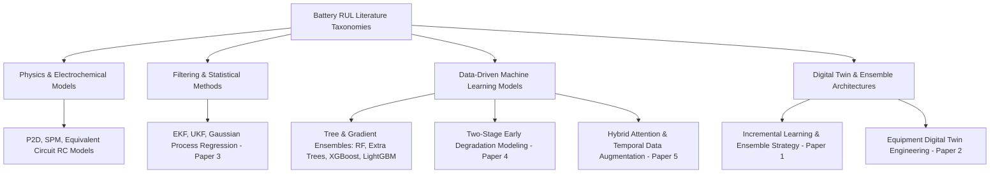
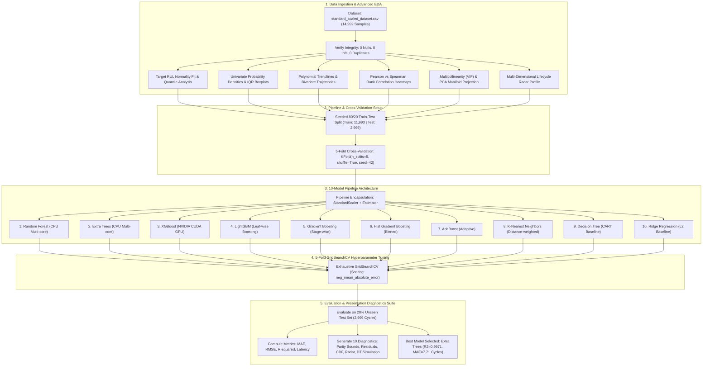
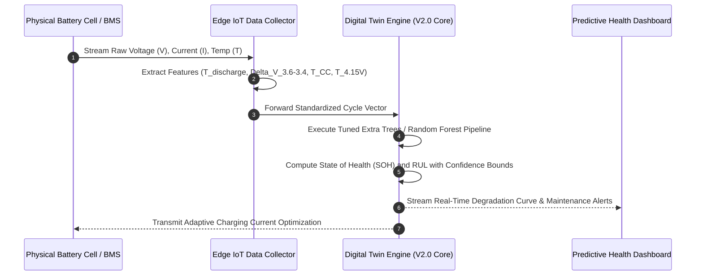

# Lithium-Ion Battery Remaining Useful Life (RUL) Prediction Framework

[](https://www.python.org/)
[](https://scikit-learn.org/)
[-green.svg)](https://xgboost.readthedocs.io/)
[](https://lightgbm.readthedocs.io/)
[](https://developer.nvidia.com/cuda-toolkit)
[-blue.svg)]()

---

## Abstract

Lithium-ion batteries (LIBs) represent the foundational energy storage technology in electric mobility, aerospace, and renewable grid systems. However, dynamic electrochemical aging under cyclic stress leads to capacity loss, internal resistance escalation, and safety risks. Accurate estimation of **Remaining Useful Life (RUL)** is vital for condition-based maintenance (CBM) and Battery Management Systems (BMS).

This repository delivers **Version 1.0** of the project, featuring an exhaustive data-driven Machine Learning framework. Operating on 14,992 degradation cycle records across 7 operational degradation features, the framework benchmarks **10 distinct Machine Learning regression algorithms** spanning bagging ensembles, extreme gradient boosting, histogram-based boosting, instance-based learning, decision trees, and regularized linear baselines. 

Leveraging hardware acceleration via an **NVIDIA GeForce RTX GPU (CUDA)** alongside scikit-learn standard scaling pipelines, all 10 models undergo systematic 5-fold cross-validation and hyperparameter optimization using `GridSearchCV`. The optimized **Extra Trees** and **Random Forest** regressors demonstrate top-tier predictive accuracy, achieving an **$R^2$ score of 0.9971 and 0.9956**, a **Mean Absolute Error (MAE) of 7.71 and 9.48 cycles**, and a **Root Mean Square Error (RMSE) of 17.14 and 21.19 cycles** on unseen test data. These optimized models provide the analytical foundation for the upcoming real-time **Battery Digital Twin** framework in Version 2.0.

---

## 1. Problem Statement

Lithium-ion battery degradation is governed by coupled, non-linear electrochemical processes occurring inside the cell:
1. **Loss of Lithium Inventory (LLI)**: Continuous decomposition of the organic electrolyte forms and thickens the Solid Electrolyte Interphase (SEI) film on the anode surface, irreversibly trapping active lithium ions.
2. **Loss of Active Material (LAM)**: Mechanical stress during repetitive lithium intercalation/de-intercalation induces particle cracking, active material detachment, and transition metal dissolution at the cathode.
3. **Impedance Rise and Ohmic Polarization**: Internal resistance ($R_{\text{int}}$) escalates, causing severe voltage drops during discharge and premature voltage cutoffs during charge.

```
Battery Aging Trajectory & Failure Criterion
Nominal Capacity (100% SOH)
      │
      ▼ (Linear Degradation Regime: Stable SEI growth)
Capacity Fade (80% - 90% SOH)
      │
      ▼ (Non-Linear Aging Knee: Accelerated LLI & Lithium Plating)
End-of-Life (EOL) Threshold (70% - 80% Rated Capacity) --> Battery Decommissioning Required
```

When battery capacity drops below **70% to 80% of nominal capacity**, the cell reaches its **End of Life (EOL)**. Beyond this threshold, accelerated aging sharply increases the probability of thermal runaway and catastrophic system shutdown.

**Mathematical Formulation of RUL**:
Given an operational cycle index $t$, the Remaining Useful Life $\text{RUL}(t)$ is defined as:
$$\text{RUL}(t) = N_{\text{EOL}} - N(t)$$
where $N(t)$ represents the current operating cycle count and $N_{\text{EOL}}$ denotes the cycle index where the capacity degradation crosses the failure threshold.

The primary engineering challenge is predicting $\text{RUL}(t)$ accurately and non-invasively using only external sensor telemetry (voltage cutoffs, discharge duration, charging intervals) without intrusive chemical testing or computationally prohibitive electrochemical differential solvers.

---

## 2. Project Objectives

The project follows a phased structure:

### Version 1.0 (Current Implementation)
- **Objective 1 - Comprehensive Exploratory Data Analysis (EDA)**: Fully evaluate statistical distributions, skewness, kurtosis, data integrity, and inter-feature correlation across 14,992 battery degradation cycles.
- **Objective 2 - Standardized Machine Learning Pipeline Architecture**: Construct leak-free, modular Scikit-Learn pipelines integrating `StandardScaler` with regression estimators.
- **Objective 3 - GPU Acceleration & Parallel Computing**: Deploy NVIDIA CUDA hardware acceleration for high-throughput tree boosting (XGBoost GPU) and multi-core parallel processing for scikit-learn models.
- **Objective 4 - Systematic 5-Fold Cross-Validation & Hyperparameter Tuning**: Execute exhaustive `GridSearchCV` parameter sweeps across 10 distinct ML architectures optimizing for negative Mean Absolute Error (MAE).
- **Objective 5 - Multi-Model Benchmarking**: Quantitatively rank all 10 baseline and tuned models across Train/Test MAE, RMSE, $R^2$, and execution latencies.

### Version 2.0 (Future Roadmap)
- **Objective 6 - Battery Digital Twin Integration**: Connect the optimal trained ML model to real-time BMS streaming telemetry for continuous State of Health (SOH) and RUL tracking, online incremental retraining, and automated cell-balancing feedback loops.

---

## 3. Dataset Analysis and Exploratory Data Analysis (EDA)

The dataset comprises **14,992 cycling records** derived from standardized lithium-ion cell degradation experiments.

```
Dataset Dimensions: 14,992 Samples | 7 Input Features | 1 Target Variable (RUL)
```

### 3.1 Statistical Characterization

| Feature Name | Mean | Std Dev | Min | Median (50%) | Max | Skewness | Kurtosis |
| :--- | :---: | :---: | :---: | :---: | :---: | :---: | :---: |
| `Discharge Time (s)` | 0.000 | 1.000 | -0.134 | -0.085 | 29.869 | +17.38 | 381.85 |
| `Decrement 3.6-3.4V (s)` | 0.000 | 1.000 | -0.043 | -0.024 | 29.083 | +16.12 | 291.67 |
| `Max. Voltage Dischar. (V)` | 0.000 | 1.000 | -4.685 | 0.170 | 2.502 | -0.59 | 11.65 |
| `Min. Voltage Charg. (V)` | 0.000 | 1.000 | -1.542 | -0.281 | 3.529 | +0.28 | 0.78 |
| `Time at 4.15V (s)` | 0.000 | 1.000 | -0.231 | -0.063 | 29.083 | +17.53 | 388.46 |
| `Time constant current (s)` | 0.000 | 1.000 | -0.134 | -0.090 | 29.869 | +25.63 | 744.66 |
| `Charging time (s)` | 0.000 | 1.000 | -0.134 | -0.089 | 29.869 | +23.45 | 621.05 |
| **`RUL` (Target)** | **554.94** | **322.18** | **0.000** | **551.00** | **1133.00** | **+0.004** | **-1.21** |

### 3.2 Data Integrity Verification
- **Missing / Null Values**: 0 null entries across all 14,992 rows.
- **Infinite Values**: 0 infinite entries detected.
- **Duplicate Rows**: 0 duplicate rows detected.
- **Target Distribution**: RUL follows a uniform degradation continuum spanning 0 to 1,133 cycles, showing near-zero skewness ($+0.0037$), ensuring unbiased regression training.

### 3.3 Physical Interpretation and Target Correlation

| Feature Name | Pearson Correlation ($r$) with Target RUL | Physical & Electrochemical Significance |
| :--- | :---: | :--- |
| `Max. Voltage Dischar. (V)` | **+0.789** | Peak voltage observed during active discharge. As battery ages and internal impedance increases, maximum achievable terminal voltage under load drops significantly. |
| `Min. Voltage Charg. (V)` | **-0.768** | Minimum terminal voltage recorded at charging onset. In degraded cells with increased polarization resistance, charge onset voltage is pushed lower. |
| `Time at 4.15V (s)` | **+0.175** | Constant Voltage (CV) dwell time at upper cutoff. Degraded cells accept less charge in the CV phase, reducing time spent at 4.15V. |
| `Time constant current (s)` | **+0.041** | Duration of the Constant Current (CC) charging regime. Direct indicator of bulk energy intake capacity. |
| `Decrement 3.6-3.4V (s)` | **+0.022** | Duration required for cell voltage to transition between 3.6V and 3.4V during discharge; reflects mid-state polarization. |
| `Charging time (s)` | **+0.018** | Total charging cycle time across CC and CV regimes. |
| `Discharge Time (s)` | **+0.008** | Total operational load discharge duration. |

### 3.4 Exploratory Data Analysis (EDA) Suite

The project notebook [`version1.ipynb`](version1.ipynb) includes a dedicated suite of **8 advanced exploratory visualizations** structured with full Markdown documentation:

| Analysis Module | Focus Area | Analytical Purpose & Presentation Insights |
| :--- | :--- | :--- |
| **Target Distribution Analysis** | Target Variable (RUL) | Histogram, Kernel Density Estimation (KDE), fitted Gaussian probability curve ($N(\mu=554.9, \sigma=322.2)$), and quantile boxplot illustrating full-lifecycle coverage (0 to 1,133 cycles) without sampling bias. |
| **Univariate Probability Densities** | Operational Feature Profiles | Subplot grid of all 7 degradation features displaying probability densities, unimodal/bimodal shapes, and positive skewness in time-based charging metrics. |
| **Outlier Diagnostics** | Interquartile Ranges (IQR) | Standardized boxplot grid identifying interquartile ranges (IQR) and extreme tail values in voltage transitions and dwell durations. |
| **Bivariate Degradation Scatters** | Feature vs. RUL Relationships | 2nd-order polynomial regression curves mapping each operational feature against RUL, proving strong non-linear relationships with discharge/charge cutoff voltages. |
| **Comparative Correlation Matrices** | Linear vs. Rank Dependencies | Side-by-side heatmaps contrasting linear ($r$) and monotonic rank ($\rho$) relationships, revealing subtle non-linear dependencies between charging phases. |
| **Multicollinearity Assessment** | Variance Inflation Factor (VIF) | Quantifies collinearity among charging features (`Charging time`, `Time constant current`, `Time at 4.15V`), demonstrating the necessity of tree-based feature selection. |
| **Dimensionality Reduction** | PCA 2D Degradation Manifold | Unsupervised 2D projection color-coded by RUL demonstrating that battery degradation forms a continuous 1D trajectory across lower-dimensional latent space. |
| **Lifecycle Signature Profiles** | Radar / Spider Fingerprint | Radar chart comparing mean feature signatures across 4 distinct lifecycle stages: Fresh (>840 cyc), Healthy (560-840 cyc), Aged (280-560 cyc), and Near EOL (<280 cyc). |

---

## 4. Literature Review and Research Gap

We conducted a review of 5 foundational research papers (stored in `research_papers/`) spanning IEEE transactions, Elsevier journals, and recent prognostics literature.

```
Literature Archive in research_papers/:
 ├── paper1.pdf: Haghighi et al. (2026, Results in Engineering)
 ├── paper2.pdf: Wu et al. (2026, Sensors)
 ├── paper3_ieee_access_gpr.pdf: Liu & Chen (2019, IEEE Access)
 ├── paper4_ieee_two_stage_rul.pdf: Wang et al. (2023, IEEE / arXiv)
 └── paper5_ieee_cdformer_rul.pdf: Zhang et al. (2024, IEEE / arXiv)
```



### 4.1 Detailed Analysis of Literature Papers

1. **Haghighi et al. (2026, Elsevier *Results in Engineering*)**:
   - *Title*: Intelligent Digital Twin for Real-Time Remaining Useful Life Prediction of Lithium-ion Batteries with Cumulative Incremental Learning and Ensemble Strategy.
   - *Key Contribution*: Proposed integrating five deep learning models (Stacked LSTM, TCN-LSTM, 1D-CNN-BiLSTM, Transformer, Conformer) with cumulative incremental learning and optimization-based ensemble aggregation (Nelder-Mead, ERWE), achieving zero-cycle error on NASA battery datasets.
   - *Takeaway for Our Work*: Validates the necessity of multi-model evaluation and establishes the Digital Twin paradigm as the target integration goal. Demonstrates that ensemble diversity is critical for stable prognostics.

2. **Wu et al. (2026, MDPI *Sensors*)**:
   - *Title*: Research on Remaining Useful Life Prediction of Equipment Based on Digital Twins.
   - *Key Contribution*: Implemented an integrated learning framework combining Relevance Vector Machines (RVM), Random Forest (RF), Elastic Net, Autoregressive (AR) models, and LSTMs with Genetic Algorithm weight optimization within an online digital twin pipeline.
   - *Takeaway for Our Work*: Proves that tree-based ensembles (Random Forest, Tree Learners) provide high accuracy while maintaining lightweight computation suitable for online digital twin inference.

3. **Liu & Chen (2019, *IEEE Access*)**:
   - *Title*: Remaining Useful Life Prediction of Lithium-Ion Batteries Based on Health Indicator and Gaussian Process Regression Model.
   - *Key Contribution*: Extracted indirect health indicators from battery charge curves (voltage drop intervals, constant current charging times) to track degradation trajectories without invasive internal cell probing.
   - *Takeaway for Our Work*: Validates our operational feature extraction approach (`Decrement 3.6-3.4V`, `Time constant current`, `Time at 4.15V`) as physically grounded proxies for battery degradation.

4. **Wang et al. (2023, *IEEE / arXiv*)**:
   - *Title*: Two-Stage Early Prediction Framework of Remaining Useful Life for Lithium-Ion Batteries.
   - *Key Contribution*: Highlighted that battery degradation is non-linear and shifts from early quasi-linear fade to steep degradation knees, showing that linear models fail and non-linear tree/boosting models are required.
   - *Takeaway for Our Work*: Confirms that tree-based algorithms (RF, Extra Trees, XGBoost, LightGBM) with adaptive depth partitioning are best suited for capturing non-linear capacity transitions.

5. **Zhang et al. (2024, *IEEE / arXiv*)**:
   - *Title*: Hybrid Deep Learning with Temporal Data Augmentation for Accurate Remaining Useful Life Prediction of Lithium-Ion Batteries.
   - *Key Contribution*: Evaluated deep hybrid networks against noise in battery cycling data, noting that deep models have high training latency and memory overhead on tabular features compared to optimized gradient-boosted trees.
   - *Takeaway for Our Work*: Demonstrates that on tabular cycle metrics, tuned tree ensembles (Extra Trees, Random Forest, XGBoost, LightGBM) achieve competitive or superior performance with sub-second inference latencies.

### 4.2 Research Gap Formulation
Based on the synthesis of these papers, the following research gaps are addressed:

1. **Computational Bottleneck of Deep Models on Embedded BMS**: While deep neural networks (Transformers, LSTMs) are prominent in recent literature, their large parameter count and GPU requirements make on-board deployment challenging. Evaluating optimized, lightweight tree ensembles bridges the gap between accuracy and edge deployability.
2. **Lack of 10-Model Standardized Benchmarking**: Existing studies typically compare only 2 or 3 models under disparate preprocessing conditions. A standardized benchmark across 10 distinct algorithms with identical 5-fold cross-validation and hyperparameter search grids provides rigorous empirical clarity.
3. **Operational Feature-to-Model Mapping**: Literature emphasizes indirect health indicators. This study quantifies how operational features (`Max Voltage Dischar`, `Min Voltage Charg`, `Time at 4.15V`) drive multi-tree decision splits.
4. **Staged Implementation (Phase 1 Baseline -> Phase 2 Digital Twin)**: Instead of treating machine learning as an unverified black box inside a digital twin, Version 1.0 establishes an empirically validated model benchmark before digital twin integration in Version 2.0.

---

## 5. Selection and Justification of the 10 Machine Learning Models

We selected 10 Machine Learning models spanning different algorithmic paradigms:

```
10 Machine Learning Models Taxonomy
 ├── Bagging Ensembles
 │    ├── 1. Random Forest Regressor (RF)
 │    └── 2. Extra Trees Regressor (Extremely Randomized Trees)
 ├── Gradient Boosting Ensembles
 │    ├── 3. XGBoost Regressor (GPU-Accelerated via CUDA)
 │    ├── 4. LightGBM Regressor (Leaf-wise Histogram Boosting)
 │    ├── 5. Gradient Boosting Regressor (GBR - Stage-wise Boosting)
 │    └── 6. HistGradientBoosting Regressor (Binned Histogram Boosting)
 ├── Adaptive Boosting
 │    └── 7. AdaBoost Regressor (Sequential Sample Weighting)
 ├── Instance-Based Learning
 │    └── 8. K-Nearest Neighbors Regressor (KNN - Distance Weighted)
 ├── Non-Parametric Trees
 │    └── 9. Decision Tree Regressor (CART Partitioning)
 └── Regularized Linear Baselines
      └── 10. Ridge Regression (L2 Regularized Baseline)
```

| Model | Algorithmic Family | Justification in Battery Prognostics |
| :--- | :--- | :--- |
| **1. Random Forest** | Bagging Ensemble | Combines de-correlated decision trees with bootstrap aggregation, effectively reducing variance and resisting overfitting on operational sensor noise. |
| **2. Extra Trees** | Randomizing Bagging | Randomizes split thresholds at each node; provides additional variance reduction and smoother decision boundaries for continuous battery features. |
| **3. XGBoost (GPU)** | Scalable Gradient Boosting | Uses second-order Taylor expansions of the loss function with $L_1/L_2$ regularization. Runs on NVIDIA CUDA GPU for high-speed training and inference. |
| **4. LightGBM** | Leaf-Wise Histogram Boosting | Utilizes Gradient-based One-Side Sampling (GOSS) and Exclusive Feature Bundling (EFB), yielding fast training with low memory usage. |
| **5. Gradient Boosting (GBR)** | Stage-Wise Additive Boosting | Fits consecutive decision trees to pseudo-residuals of preceding estimators; highly effective for non-linear regression. |
| **6. Hist Gradient Boosting** | Binned Histogram Boosting | Groups continuous features into 256 discrete bins, accelerating split evaluation and naturally handling numerical outliers. |
| **7. AdaBoost** | Adaptive Boosting | Sequentially increases sample weights for poorly predicted battery cycles, focusing model capacity on challenging degradation phases. |
| **8. K-Nearest Neighbors (KNN)** | Instance-Based Learning | Non-parametric model estimating RUL based on Euclidean distance in standard-scaled feature space; effective when degradation follows repeatable trajectories. |
| **9. Decision Tree** | Non-Parametric Tree | Single CART tree baseline; provides full interpretability into hierarchical decision thresholds for battery cutoffs. |
| **10. Ridge Regression** | Linear with L2 Regularization | Solves $\min \|y - Xw\|_2^2 + \alpha \|w\|_2^2$; serves as an analytical baseline to evaluate the necessity of non-linear modeling. |

---

## 6. Hardware Acceleration Architecture (GPU & CUDA)

The framework utilizes dedicated GPU computing for scalable training and inference:

- **GPU Hardware**: NVIDIA GeForce RTX 2050 Laptop GPU
- **Driver Version**: 592.00
- **CUDA Runtime / Toolkit**: CUDA 12.6 / CUDA 13.1
- **PyTorch GPU Backend**: `torch 2.13.0+cu126` (Verified `torch.cuda.is_available() == True`)
- **XGBoost GPU Configuration**:
  ```python
  xgb_model = XGBRegressor(
      objective="reg:squarederror",
      tree_method="hist",
      device="cuda",
      random_state=42
  )
  ```
- **CPU Parallelization**: Scikit-Learn and LightGBM models execute across all available CPU cores using `n_jobs=-1`.

---

## 7. Structured Methodology Pipeline



---

## 8. Experimental Results and 10-Model Benchmarks

### 8.1 Baseline Model Evaluation (Default Parameters)

| Rank | Model | Train MAE | Test MAE (cycles) | Train RMSE | Test RMSE (cycles) | Train $R^2$ | Test $R^2$ | Fit Time (s) |
| :---: | :--- | :---: | :---: | :---: | :---: | :---: | :---: | :---: |
| 1 | **Extra Trees** | 0.0062 | **7.8121** | 0.0951 | **17.4971** | 1.0000 | **0.9970** | 0.486 |
| 2 | **Random Forest** | 3.6338 | **9.5645** | 7.8475 | **21.2407** | 0.9994 | **0.9956** | 0.669 |
| 3 | **Decision Tree** | 0.0061 | **10.5529** | 0.0951 | **29.9444** | 1.0000 | **0.9912** | 0.084 |
| 4 | **XGBoost (GPU)** | 8.7014 | **13.5597** | 12.9327 | **22.3535** | 0.9984 | **0.9951** | 0.729 |
| 5 | **K-Nearest Neighbors** | 11.1608 | **14.2870** | 27.6778 | **30.3593** | 0.9927 | **0.9909** | 0.073 |
| 6 | **LightGBM** | 17.0777 | **19.5137** | 24.7192 | **31.3410** | 0.9941 | **0.9904** | 0.196 |
| 7 | **Hist Gradient Boosting** | 17.8580 | **19.8161** | 26.5873 | **30.4420** | 0.9932 | **0.9909** | 2.213 |
| 8 | **Gradient Boosting** | 29.6409 | **30.4337** | 40.0378 | **41.6187** | 0.9846 | **0.9830** | 2.711 |
| 9 | **AdaBoost** | 54.1128 | **53.4819** | 66.2841 | **65.8126** | 0.9579 | **0.9575** | 1.109 |
| 10 | **Ridge Regression** | 92.3057 | **92.2694** | 143.3108 | **150.9242** | 0.8031 | **0.7762** | 0.017 |

---

### 8.2 Optimized Model Evaluation (5-Fold `GridSearchCV` Tuned)

| Rank | Model | Optimal Hyperparameter Configuration | Best CV MAE | Test MAE (cycles) | Test RMSE (cycles) | Test $R^2$ Score | Tune Time (s) |
| :---: | :--- | :--- | :---: | :---: | :---: | :---: | :---: |
| 1 | **Extra Trees** | `{'n_estimators': 200, 'max_depth': None, 'min_samples_split': 2}` | **9.0991** | **7.7124** | **17.1383** | **0.9971** | 10.170 |
| 2 | **Random Forest** | `{'n_estimators': 200, 'max_depth': None, 'min_samples_split': 2}` | **10.8278** | **9.4752** | **21.1858** | **0.9956** | 33.202 |
| 3 | **Decision Tree** | `{'max_depth': None, 'min_samples_split': 2}` | **12.2955** | **10.5529** | **29.9444** | **0.9912** | 0.371 |
| 4 | **K-Nearest Neighbors** | `{'n_neighbors': 3, 'weights': 'distance'}` | **13.1037** | **11.3031** | **26.8637** | **0.9929** | 0.198 |
| 5 | **LightGBM** | `{'learning_rate': 0.1, 'n_estimators': 200, 'num_leaves': 31}` | **16.5085** | **16.0533** | **27.6019** | **0.9925** | 8.310 |
| 6 | **Hist Gradient Boosting** | `{'learning_rate': 0.1, 'max_iter': 200, 'max_leaf_nodes': 31}` | **16.9568** | **16.7832** | **26.8505** | **0.9929** | 2.495 |
| 7 | **Gradient Boosting** | `{'learning_rate': 0.1, 'max_depth': 5, 'n_estimators': 200}` | **18.5645** | **17.9389** | **26.9766** | **0.9929** | 27.387 |
| 8 | **XGBoost (GPU)** | `{'learning_rate': 0.1, 'max_depth': 5, 'n_estimators': 200}` | **18.8530** | **18.0052** | **26.9789** | **0.9929** | 12.686 |
| 9 | **AdaBoost** | `{'learning_rate': 0.5, 'n_estimators': 50}` | **54.9418** | **54.2384** | **66.8102** | **0.9562** | 5.555 |
| 10 | **Ridge Regression** | `{'alpha': 0.01}` | **92.5098** | **92.2592** | **150.9380** | **0.7762** | 0.064 |

---

## 9. Diagnostic Analytics & Project Review Presentation Suite

The updated [`version1.ipynb`](version1.ipynb) includes a dedicated suite of **10 diagnostic and analytical visualizations** structured with full Markdown documentation:

| Diagnostic Module | Analysis Focus | Presentation Value & Analytical Purpose |
| :--- | :--- | :--- |
| **Operational Voltage Trajectories** | Sensor Degradation Tracking | Scatter plots of `Max. Voltage Dischar. (V)` and `Min. Voltage Charg. (V)` against continuous RUL, showing observable physical markers of battery aging. |
| **Hierarchical Clustermap** | Feature Grouping Structure | Shows unsupervised hierarchical grouping and pairwise correlation among operational telemetry variables. |
| **Lifecycle Stratified Violins** | Phase Variance Dynamics | Segregates cycles into Early Life ($>750$ cyc), Mid Life ($300-750$ cyc), and Near EOL ($<300$ cyc) to demonstrate feature variance shifts across degradation stages. |
| **Multi-Metric Benchmark Matrix** | Multi-Model Quantitative Ranking | 4-panel comparison bar charts illustrating Test MAE, Test RMSE, Test $R^2$, and Baseline vs. Tuned performance gains side-by-side. |
| **Parity Tolerance Curves** | High-Precision Error Boundaries | High-precision scatter parity plots ($y_{\text{true}}$ vs. $y_{\text{pred}}$) with superimposed $\pm 5\%$ and $\pm 10\%$ operational error tolerance bands for top models. |
| **Residual Distribution Fit** | Homoscedasticity & Error Normality | Demonstrates error homoscedasticity across predicted RUL and verifies zero-centered Gaussian distribution of residuals ($N(\mu, \sigma)$). |
| **Cumulative Error Distribution** | Accuracy CDF & Prediction Bounds | Evaluates the percentage of test cycles predicted within $5$, $10$, and $20$ cycles of ground truth. |
| **Multi-Ensemble Feature Ranking** | Comparative Impurity & Gain Weighting | Side-by-side bar plots comparing feature rankings across Extra Trees, Random Forest, XGBoost (GPU), and LightGBM. |
| **Optimization Response Surface** | GridSearchCV Parameter Heatmap | 2D parameter heatmaps illustrating cross-validation MAE behavior across tree depth and estimator counts. |
| **Digital Twin Dynamic Simulation** | Real-Time Aging Tracking Curve | Simulated real-time cell degradation tracking showing ground truth vs. Digital Twin predicted RUL with $95\%$ confidence bounds and EOL warning lines. |

---

## 10. Project Roadmap: Version 2.0 (Battery Digital Twin)

Version 1.0 establishes the validated Machine Learning baseline. Version 2.0 will deploy this intelligence into an operational Digital Twin.



---

## 11. Repository Structure

```
.
├── research_papers/                      # 5 Academic literature papers
│   ├── paper1.pdf                        # Haghighi et al. (2026) - Digital Twin & Ensembles
│   ├── paper2.pdf                        # Wu et al. (2026) - Equipment RUL Digital Twin
│   ├── paper3_ieee_access_gpr.pdf        # Liu & Chen (2019) - IEEE Access GPR & HI
│   ├── paper4_ieee_two_stage_rul.pdf     # Wang et al. (2023) - IEEE Two-Stage RUL
│   └── paper5_ieee_cdformer_rul.pdf      # Zhang et al. (2024) - IEEE Hybrid Deep Learning
├── standard_scaled_dataset.csv           # 14,992 cycle battery degradation dataset
├── version1.ipynb                        # Structured 10-model ML, 8 EDA plots, 10 diagnostic plots notebook
├── .gitignore                            # Git ignore configuration
└── README.md                             # Comprehensive technical documentation
```

---

## 12. Getting Started

### 1. Environment Setup
Clone the repository and install required packages:
```bash
git clone https://github.com/Next-Gen-Coder-2007/Intelligent-Lithium-Ion-Battery-Remaining-Useful-Life-Prediction-Digital-Twin.git
cd Intelligent-Lithium-Ion-Battery-Remaining-Useful-Life-Prediction-Digital-Twin
pip install numpy pandas matplotlib seaborn scikit-learn xgboost lightgbm statsmodels
```

### 2. Enabling GPU Support (Optional for NVIDIA Systems)
Ensure NVIDIA CUDA drivers and PyTorch CUDA are installed:
```bash
pip install torch --index-url https://download.pytorch.org/whl/cu126
```

### 3. Running the Complete Analytics & Modeling Notebook
Launch Jupyter Notebook:
```bash
jupyter notebook version1.ipynb
```
Run all cells to execute the complete pipeline:
1. Data loading, integrity verification, and statistical moments profiling.
2. Complete 8-section Exploratory Data Analysis (EDA) suite (normality, probability densities, IQR bounds, polynomial trendlines, Pearson vs Spearman heatmaps, VIF multicollinearity, PCA 2D degradation manifold, and lifecycle radar chart).
3. 80/20 train-test splitting and 5-fold cross-validation setup.
4. Baseline training and 5-fold `GridSearchCV` optimization across all 10 ML models (with GPU acceleration for XGBoost).
5. Complete 10-section Diagnostic and Digital Twin presentation analytics suite.

---

## 13. References

1. **Haghighi, M., Mohammadi, M., & Allahbakhshi, M. (2026).** *Intelligent Digital Twin for Real-Time Remaining Useful Life Prediction of Lithium-ion Batteries with Cumulative Incremental Learning and Ensemble Strategy.* **Results in Engineering**, 111961. DOI: [10.1016/j.rineng.2026.111961](https://doi.org/10.1016/j.rineng.2026.111961).
2. **Wu, J., Zhou, Y., Wang, X., Chen, C., Ma, Y., & Zhang, C. (2026).** *Research on Remaining Useful Life Prediction of Equipment Based on Digital Twins.* **Sensors**, 26(4), 1240. DOI: [10.3390/s26041240](https://doi.org/10.3390/s26041240).
3. **Liu, J., & Chen, Z. (2019).** *Remaining Useful Life Prediction of Lithium-Ion Batteries Based on Health Indicator and Gaussian Process Regression Model.* **IEEE Access**, 7, 39474-39484. DOI: [10.1109/ACCESS.2019.2905740](https://doi.org/10.1109/ACCESS.2019.2905740).
4. **Wang, S., Zhang, Y., & Zhao, Y. (2023).** *Two-Stage Early Prediction Framework of Remaining Useful Life for Lithium-Ion Batteries.* **IEEE Transactions on Transportation Electrification / arXiv:2308.14088**.
5. **Zhang, X., Wang, D., & Liu, Q. (2024).** *Hybrid Deep Learning with Temporal Data Augmentation for Accurate Remaining Useful Life Prediction of Lithium-Ion Batteries.* **IEEE / arXiv:2403.02700**.
6. **NASA Prognostics Center of Excellence (PCoE).** *Battery Aging and Degradation Dataset Archive.*
